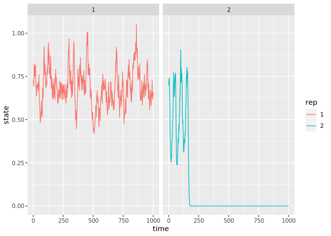
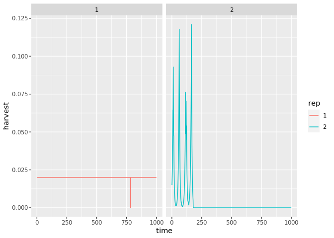
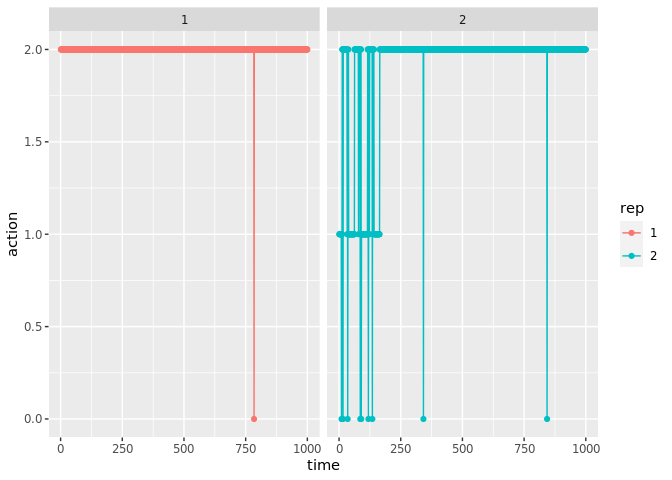

``` r
unlink("fishing.csv")
```

``` python
import gym
import gym_fishing
from stable_baselines.common.policies import MlpPolicy
```

``` python
from stable_baselines.common.vec_env import DummyVecEnv
from stable_baselines import PPO2
```

``` python
env = gym.make('fishing-v0')
env.n_actions = 100
model = PPO2(MlpPolicy, env, verbose=1)
```

``` python
model.learn(total_timesteps=200000)
```

``` python
obs = env.reset()
for i in range(1000):
    action, _states = model.predict(obs)
    obs, rewards, dones, info = env.step(action)
    env.render()

env.close()
```

## 3 discrete states

``` python
env = gym.make('fishing-v0')
env.n_actions = 3
model = PPO2(MlpPolicy, env, verbose=1)
```

``` python
model.learn(total_timesteps=200000)
```

``` python
obs = env.reset()
for i in range(1000):
    action, _states = model.predict(obs)
    obs, rewards, dones, info = env.step(action)
    env.render()

env.close()
```

``` r
library(tidyverse)
```

    ## ── Attaching packages ──────────────────────────────────────────────────────────── tidyverse 1.3.0 ──

    ## ✓ ggplot2 3.3.0     ✓ purrr   0.3.3
    ## ✓ tibble  2.1.3     ✓ dplyr   0.8.5
    ## ✓ tidyr   1.0.2     ✓ stringr 1.4.0
    ## ✓ readr   1.3.1     ✓ forcats 0.5.0

    ## ── Conflicts ─────────────────────────────────────────────────────────────── tidyverse_conflicts() ──
    ## x dplyr::filter() masks stats::filter()
    ## x dplyr::lag()    masks stats::lag()

``` r
fishing <- read_csv("fishing.csv", 
                    col_names = c("time", "state", "harvest", "action"))
```

    ## Parsed with column specification:
    ## cols(
    ##   time = col_double(),
    ##   state = col_double(),
    ##   harvest = col_double(),
    ##   action = col_double()
    ## )

``` r
d <- max(fishing$time)
n <-dim(fishing)[1] / d

fishing$rep <- as.character(vapply(1:n, rep, integer(d), d))

## Reward is calculated as net (cumulative) reward without any discounting (gamma = 1)
gamma <- 1.0
price <- 1.0
fishing <- fishing %>% 
  group_by(rep) %>% 
  mutate(reward = cumsum(price * harvest * gamma^time))

fishing %>% summarize(max(reward))
```

    ## # A tibble: 2 x 2
    ##   rep   `max(reward)`
    ##   <chr>         <dbl>
    ## 1 1             20.0 
    ## 2 2              4.45

``` r
fishing %>% 
#  filter(time < 100) %>%
  ggplot(aes(time, state, col = rep)) + geom_line() + facet_wrap(~rep)
```

<!-- -->

``` r
fishing %>% 
#  filter(time < 150) %>%
  ggplot(aes(time, harvest, col = rep)) + geom_line()  + facet_wrap(~rep)
```

<!-- -->

``` r
fishing %>% 
 # filter(time < 30) %>%
  ggplot(aes(time, action, col = rep)) + geom_point() + geom_line() + facet_wrap(~rep)
```

<!-- -->
