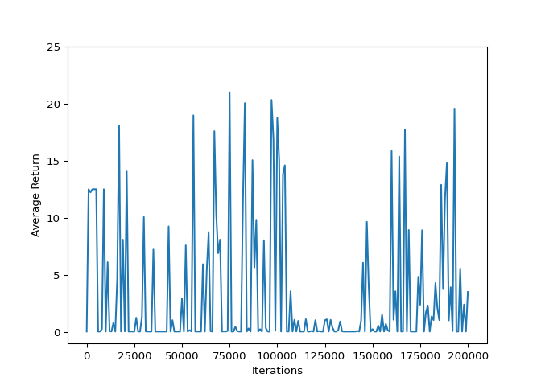

## Introduction

This example shows how to train a [DQN (Deep Q
Networks)](https://storage.googleapis.com/deepmind-media/dqn/DQNNaturePaper.pdf)
agent on the Cartpole environment using the TF-Agents library.


It will walk you through all the components in a Reinforcement Learning
(RL) pipeline for training, evaluation and data collection.

## Setup

``` r
library(reticulate)
reticulate::use_virtualenv("~/.virtualenvs/tf2.0")
#reticulate::py_discover_config()
```

``` python


from __future__ import absolute_import, division, print_function

import gym_fishing

import gym
import base64
import numpy as np
import tensorflow as tf

from tf_agents.agents.dqn import dqn_agent
from tf_agents.drivers import dynamic_step_driver
from tf_agents.environments import suite_gym
from tf_agents.environments import tf_py_environment
from tf_agents.eval import metric_utils
from tf_agents.metrics import tf_metrics
from tf_agents.networks import q_network
from tf_agents.policies import random_tf_policy
from tf_agents.replay_buffers import tf_uniform_replay_buffer
from tf_agents.trajectories import trajectory
from tf_agents.utils import common

#### Acitvate compatibility settings 
##tf.compat.v1.enable_v2_behavior()
### change default float
## tf.keras.backend.set_floatx('float64')

## Disable GPU, optional
#import os
#os.environ["CUDA_VISIBLE_DEVICES"] = "-1"

tf.version.VERSION
```

    ## '2.1.0'

``` python
## Hyperparameters
num_iterations = 200000             # @param {type:"integer"}
initial_collect_steps = 1000        # @param {type:"integer"} 
collect_steps_per_iteration = 1     # @param {type:"integer"}
replay_buffer_max_length = 1000000  # @param {type:"integer"}
batch_size = 64                     # @param {type:"integer"}
learning_rate = 1e-3                # @param {type:"number"}
log_interval = 200                  # @param {type:"integer"}
num_eval_episodes = 10              # @param {type:"integer"}
eval_interval = 1000                # @param {type:"integer"}

## Environment
env_name = 'fishing-v0'
env = suite_gym.load(env_name)
env.reset()
```

    ## TimeStep(step_type=array(0, dtype=int32), reward=array(0., dtype=float32), discount=array(1., dtype=float32), observation=array([0.75]))

The `environment.step` method takes an `action` in the environment and
returns a `TimeStep` tuple containing the next observation of the
environment and the reward for the action.

The `time_step_spec()` method returns the specification for the
`TimeStep` tuple. Its `observation` attribute shows the shape of
observations, the data types, and the ranges of allowed values. The
`reward` attribute shows the same details for the
    reward.

``` python
print('Observation Spec:')
```

    ## Observation Spec:

``` python
print(env.time_step_spec().observation)
```

    ## BoundedArraySpec(shape=(1,), dtype=dtype('float64'), name='observation', minimum=0.0, maximum=2.0)

``` python
print('Reward Spec:')
```

    ## Reward Spec:

``` python
print(env.time_step_spec().reward)
```

    ## ArraySpec(shape=(), dtype=dtype('float32'), name='reward')

The `action_spec()` method returns the shape, data types, and allowed
values of valid
    actions.

``` python
print('Action Spec:')
```

    ## Action Spec:

``` python
print(env.action_spec())
```

    ## BoundedArraySpec(shape=(), dtype=dtype('int64'), name='action', minimum=0, maximum=2)

In the `fishing-v0` environment:

  - `observation` is an array of 1 floating point number: current fish
    density
  - `reward` is a scalar float value
  - `action` is a scalar integer with only three possible values:
  - `0` - “maintain previous harvest”
  - `1` - “increase harvest by 20%”
  - `2` - “decrease harvest by 20%”

<!-- end list -->

``` python
time_step = env.reset()
print('Time step:')
```

    ## Time step:

``` python
print(time_step)
```

    ## TimeStep(step_type=array(0, dtype=int32), reward=array(0., dtype=float32), discount=array(1., dtype=float32), observation=array([0.75]))

``` python
action = np.array(1, dtype=np.int32)

next_time_step = env.step(action)
print('Next time step:')
```

    ## Next time step:

``` python
print(next_time_step)
```

    ## TimeStep(step_type=array(1, dtype=int32), reward=array(0.015, dtype=float32), discount=array(1., dtype=float32), observation=array([0.77200056]))

Usually two environments are instantiated: one for training and one for
evaluation.

``` python
train_py_env = suite_gym.load(env_name)
eval_py_env = suite_gym.load(env_name)
```

Our environment, like most environments, is written in pure Python. This
is converted to TensorFlow using the `TFPyEnvironment` wrapper.

The original environment’s API uses Numpy arrays. The `TFPyEnvironment`
converts these to `Tensors` to make it compatible with Tensorflow agents
and policies.

``` python
train_env = tf_py_environment.TFPyEnvironment(train_py_env)
eval_env = tf_py_environment.TFPyEnvironment(eval_py_env)
```

## Agent

The algorithm used to solve an RL problem is represented by an `Agent`.
TF-Agents provides standard implementations of a variety of `Agents`,
including:

  - [DQN](https://storage.googleapis.com/deepmind-media/dqn/DQNNaturePaper.pdf)
    (used in this
    tutorial)
  - [REINFORCE](http://www-anw.cs.umass.edu/~barto/courses/cs687/williams92simple.pdf)
  - [DDPG](https://arxiv.org/pdf/1509.02971.pdf)
  - [TD3](https://arxiv.org/pdf/1802.09477.pdf)
  - [PPO](https://arxiv.org/abs/1707.06347)
  - [SAC](https://arxiv.org/abs/1801.01290).

The DQN agent can be used in any environment which has a discrete action
space. At the heart of a DQN Agent is a `QNetwork`, a neural network
model that can learn to predict `QValues` (expected returns) for all
actions, given an observation from the environment.

Use `tf_agents.networks.q_network` to create a `QNetwork`, passing in
the `observation_spec`, `action_spec`, and a tuple describing the number
and size of the model’s hidden layers.

``` python
fc_layer_params = (100,)
q_net = q_network.QNetwork(
    train_env.observation_spec(),
    train_env.action_spec(),
    fc_layer_params=fc_layer_params)
```

Now use `tf_agents.agents.dqn.dqn_agent` to instantiate a `DqnAgent`. In
addition to the `time_step_spec`, `action_spec` and the QNetwork, the
agent constructor also requires an optimizer (in this case,
`AdamOptimizer`), a loss function, and an integer step
counter.

``` python
optimizer = tf.compat.v1.train.AdamOptimizer(learning_rate=learning_rate)
train_step_counter = tf.Variable(0)

agent = dqn_agent.DqnAgent(
    train_env.time_step_spec(),
    train_env.action_spec(),
    q_network=q_net,
    optimizer=optimizer,
    td_errors_loss_fn=common.element_wise_squared_loss,
    train_step_counter=train_step_counter)
```

    ## WARNING:tensorflow:Layer QNetwork is casting an input tensor from dtype float64 to the layer's dtype of float32, which is new behavior in TensorFlow 2.  The layer has dtype float32 because it's dtype defaults to floatx.
    ## 
    ## If you intended to run this layer in float32, you can safely ignore this warning. If in doubt, this warning is likely only an issue if you are porting a TensorFlow 1.X model to TensorFlow 2.
    ## 
    ## To change all layers to have dtype float64 by default, call `tf.keras.backend.set_floatx('float64')`. To change just this layer, pass dtype='float64' to the layer constructor. If you are the author of this layer, you can disable autocasting by passing autocast=False to the base Layer constructor.
    ## 
    ## WARNING:tensorflow:Layer TargetQNetwork is casting an input tensor from dtype float64 to the layer's dtype of float32, which is new behavior in TensorFlow 2.  The layer has dtype float32 because it's dtype defaults to floatx.
    ## 
    ## If you intended to run this layer in float32, you can safely ignore this warning. If in doubt, this warning is likely only an issue if you are porting a TensorFlow 1.X model to TensorFlow 2.
    ## 
    ## To change all layers to have dtype float64 by default, call `tf.keras.backend.set_floatx('float64')`. To change just this layer, pass dtype='float64' to the layer constructor. If you are the author of this layer, you can disable autocasting by passing autocast=False to the base Layer constructor.

``` python
agent.initialize()
```

## Policies

A policy defines the way an agent acts in an environment. Typically, the
goal of reinforcement learning is to train the underlying model until
the policy produces the desired outcome.

In this tutorial:

  - The desired outcome is keeping the pole balanced upright over the
    cart.
  - The policy returns an action (left or right) for each `time_step`
    observation.

Agents contain two policies:

  - `agent.policy` — The main policy that is used for evaluation and
    deployment.
  - `agent.collect_policy` — A second policy that is used for data
    collection.

<!-- end list -->

``` python
eval_policy = agent.policy
collect_policy = agent.collect_policy
```

Policies can be created independently of agents. For example, use
`tf_agents.policies.random_tf_policy` to create a policy which will
randomly select an action for each
`time_step`.

``` python
random_policy = random_tf_policy.RandomTFPolicy(train_env.time_step_spec(),
                                                train_env.action_spec())
```

To get an action from a policy, call the `policy.action(time_step)`
method. The `time_step` contains the observation from the environment.
This method returns a `PolicyStep`, which is a named tuple with three
components:

  - `action` — the action to be taken (in this case, `0`, `1` or `2`)
  - `state` — used for stateful (that is, RNN-based) policies
  - `info` — auxiliary data, such as log probabilities of actions

<!-- end list -->

``` python
example_environment = tf_py_environment.TFPyEnvironment(
    suite_gym.load(env_name))

time_step = example_environment.reset()
random_policy.action(time_step)
```

    ## PolicyStep(action=<tf.Tensor: shape=(1,), dtype=int64, numpy=array([1])>, state=(), info=())

## Metrics and Evaluation

The most common metric used to evaluate a policy is the average return.
The return is the sum of rewards obtained while running a policy in an
environment for an episode. Several episodes are run, creating an
average return.

The following function computes the average return of a policy, given
the policy, environment, and a number of episodes.

``` python
#@test {"skip": true}
def compute_avg_return(environment, policy, num_episodes=10):

  total_return = 0.0
  for _ in range(num_episodes):

    time_step = environment.reset()
    episode_return = 0.0

    while not time_step.is_last():
      action_step = policy.action(time_step)
      time_step = environment.step(action_step.action)
      episode_return += time_step.reward
    total_return += episode_return

  avg_return = total_return / num_episodes
  return avg_return.numpy()[0]
```

See also the metrics module for standard implementations of different
metrics:
<https://github.com/tensorflow/agents/tree/master/tf_agents/metrics>

Running this computation on the `random_policy` shows a baseline
performance in the environment.

``` python
compute_avg_return(eval_env, random_policy, num_eval_episodes)
```

    ## 1.341604

## Replay Buffer

The replay buffer keeps track of data collected from the environment.
This tutorial uses
`tf_agents.replay_buffers.tf_uniform_replay_buffer.TFUniformReplayBuffer`,
as it is the most common.

The constructor requires the specs for the data it will be collecting.
This is available from the agent using the `collect_data_spec` method.
The batch size and maximum buffer length are also required.

``` python
replay_buffer = tf_uniform_replay_buffer.TFUniformReplayBuffer(
    data_spec = agent.collect_data_spec,
    batch_size = train_env.batch_size,
    max_length = replay_buffer_max_length)

# For most agents, `collect_data_spec` is a named tuple called 
# `Trajectory`, containing the specs for observations, actions,
# rewards, and other items.
agent.collect_data_spec
```

    ## Trajectory(step_type=TensorSpec(shape=(), dtype=tf.int32, name='step_type'), observation=BoundedTensorSpec(shape=(1,), dtype=tf.float64, name='observation', minimum=array(0.), maximum=array(2.)), action=BoundedTensorSpec(shape=(), dtype=tf.int64, name='action', minimum=array(0), maximum=array(2)), policy_info=(), next_step_type=TensorSpec(shape=(), dtype=tf.int32, name='step_type'), reward=TensorSpec(shape=(), dtype=tf.float32, name='reward'), discount=BoundedTensorSpec(shape=(), dtype=tf.float32, name='discount', minimum=array(0., dtype=float32), maximum=array(1., dtype=float32)))

``` python
agent.collect_data_spec._fields
```

    ## ('step_type', 'observation', 'action', 'policy_info', 'next_step_type', 'reward', 'discount')

## Data Collection

Now execute the random policy in the environment for a few steps,
recording the data in the replay buffer.

``` python
#@test {"skip": true}
def collect_step(environment, policy, buffer):
  time_step = environment.current_time_step()
  action_step = policy.action(time_step)
  next_time_step = environment.step(action_step.action)
  traj = trajectory.from_transition(time_step, action_step, next_time_step)

  # Add trajectory to the replay buffer
  buffer.add_batch(traj)

def collect_data(env, policy, buffer, steps):
  for _ in range(steps):
    collect_step(env, policy, buffer)

collect_data(train_env, random_policy, replay_buffer, steps=100)
```

This loop is so common in RL, that we provide standard implementations.
For more details see the drivers module.
<https://github.com/tensorflow/agents/blob/master/tf_agents/docs/python/tf_agents/drivers.md>
The replay buffer is now a collection of Trajectories.

For the curious: Uncomment to peel one of these off and inspect it.

``` python
# iter(replay_buffer.as_dataset()).next()
```

The agent needs access to the replay buffer. This is provided by
creating an iterable `tf.data.Dataset` pipeline which will feed data to
the agent.

Each row of the replay buffer only stores a single observation step. But
since the DQN Agent needs both the current and next observation to
compute the loss, the dataset pipeline will sample two adjacent rows for
each item in the batch (`num_steps=2`).

This dataset is also optimized by running parallel calls and prefetching
data.

``` python
# Dataset generates trajectories with shape [Bx2x...]
dataset = replay_buffer.as_dataset(
    num_parallel_calls=3, 
    sample_batch_size=batch_size, 
    num_steps=2).prefetch(3)


dataset
```

    ## <PrefetchDataset shapes: (Trajectory(step_type=(64, 2), observation=(64, 2, 1), action=(64, 2), policy_info=(), next_step_type=(64, 2), reward=(64, 2), discount=(64, 2)), BufferInfo(ids=(64, 2), probabilities=(64,))), types: (Trajectory(step_type=tf.int32, observation=tf.float64, action=tf.int64, policy_info=(), next_step_type=tf.int32, reward=tf.float32, discount=tf.float32), BufferInfo(ids=tf.int64, probabilities=tf.float32))>

``` python
iterator = iter(dataset)

print(iterator)
```

    ## <tensorflow.python.data.ops.iterator_ops.OwnedIterator object at 0x7f996263d978>

For the curious:

Uncomment to see what the dataset iterator is feeding to the agent.
Compare this representation of replay data to the collection of
individual trajectories shown earlier.

``` python
# iterator.next()
```

## Training the agent

Two things must happen during the training loop:

  - collect data from the environment
  - use that data to train the agent’s neural network(s)

This example also periodicially evaluates the policy and prints the
current
score.

``` python
# (Optional) Optimize by wrapping some of the code in a graph using TF function.
agent.train = common.function(agent.train)

# Reset the train step
agent.train_step_counter.assign(0)

# Evaluate the agent's policy once before training.
```

    ## <tf.Variable 'UnreadVariable' shape=() dtype=int32, numpy=0>

``` python
avg_return = compute_avg_return(eval_env, agent.policy, num_eval_episodes)
returns = [avg_return]

for _ in range(num_iterations):

  # Collect a few steps using collect_policy and save to the replay buffer.
  for _ in range(collect_steps_per_iteration):
    collect_step(train_env, agent.collect_policy, replay_buffer)

  # Sample a batch of data from the buffer and update the agent's network.
  experience, unused_info = next(iterator)
  train_loss = agent.train(experience).loss

  step = agent.train_step_counter.numpy()

  if step % log_interval == 0:
    print('step = {0}: loss = {1}'.format(step, train_loss))

  if step % eval_interval == 0:
    avg_return = compute_avg_return(eval_env, agent.policy, num_eval_episodes)
    print('step = {0}: Average Return = {1}'.format(step, avg_return))
    returns.append(avg_return)
```

    ## step = 200: loss = 0.20109491050243378
    ## step = 400: loss = 1.3717825412750244
    ## step = 600: loss = 4.967068195343018
    ## step = 800: loss = 10.341028213500977
    ## step = 1000: loss = 11.996318817138672
    ## step = 1000: Average Return = 12.499879837036133
    ## step = 1200: loss = 17.304309844970703
    ## step = 1400: loss = 34.7087287902832
    ## step = 1600: loss = 25.229637145996094
    ## step = 1800: loss = 39.207908630371094
    ## step = 2000: loss = 30.450788497924805
    ## step = 2000: Average Return = 12.228882789611816
    ## step = 2200: loss = 39.65745162963867
    ## step = 2400: loss = 182.04676818847656
    ## step = 2600: loss = 53.232845306396484
    ## step = 2800: loss = 722.3258056640625
    ## step = 3000: loss = 31.95905876159668
    ## step = 3000: Average Return = 12.499879837036133
    ## step = 3200: loss = 729.1168212890625
    ## step = 3400: loss = 42.37971496582031
    ## step = 3600: loss = 49.09649658203125
    ## step = 3800: loss = 842.0108642578125
    ## step = 4000: loss = 52.24609375
    ## step = 4000: Average Return = 12.499879837036133
    ## step = 4200: loss = 45.04349899291992
    ## step = 4400: loss = 30.024215698242188
    ## step = 4600: loss = 47.74220657348633
    ## step = 4800: loss = 39.93516159057617
    ## step = 5000: loss = 39.96279525756836
    ## step = 5000: Average Return = 12.499879837036133
    ## step = 5200: loss = 47.514495849609375
    ## step = 5400: loss = 32.692378997802734
    ## step = 5600: loss = 33.576969146728516
    ## step = 5800: loss = 201.59259033203125
    ## step = 6000: loss = 46.87092208862305
    ## step = 6000: Average Return = 0.049999989569187164
    ## step = 6200: loss = 37.195987701416016
    ## step = 6400: loss = 33.23969650268555
    ## step = 6600: loss = 28.632461547851562
    ## step = 6800: loss = 49.453773498535156
    ## step = 7000: loss = 47.68655776977539
    ## step = 7000: Average Return = 0.049999989569187164
    ## step = 7200: loss = 60.82447814941406
    ## step = 7400: loss = 54.53466796875
    ## step = 7600: loss = 74.38714599609375
    ## step = 7800: loss = 46.75889587402344
    ## step = 8000: loss = 61.444114685058594
    ## step = 8000: Average Return = 0.278842031955719
    ## step = 8200: loss = 61.56724548339844
    ## step = 8400: loss = 44.68566131591797
    ## step = 8600: loss = 62.43804168701172
    ## step = 8800: loss = 56.74567413330078
    ## step = 9000: loss = 68.55799865722656
    ## step = 9000: Average Return = 12.499879837036133
    ## step = 9200: loss = 58.237281799316406
    ## step = 9400: loss = 80.37001037597656
    ## step = 9600: loss = 42.8140869140625
    ## step = 9800: loss = 60.30604553222656
    ## step = 10000: loss = 44.71227264404297
    ## step = 10000: Average Return = 0.049999989569187164
    ## step = 10200: loss = 1116.9951171875
    ## step = 10400: loss = 1445.2255859375
    ## step = 10600: loss = 368.50921630859375
    ## step = 10800: loss = 54.89615249633789
    ## step = 11000: loss = 70.50657653808594
    ## step = 11000: Average Return = 6.116626739501953
    ## step = 11200: loss = 57.97338104248047
    ## step = 11400: loss = 65.98690795898438
    ## step = 11600: loss = 64.88703918457031
    ## step = 11800: loss = 75.4268798828125
    ## step = 12000: loss = 40.97344970703125
    ## step = 12000: Average Return = 0.09510882943868637
    ## step = 12200: loss = 87.81410217285156
    ## step = 12400: loss = 70.50503540039062
    ## step = 12600: loss = 74.55677795410156
    ## step = 12800: loss = 79.18241882324219
    ## step = 13000: loss = 55.49182891845703
    ## step = 13000: Average Return = 0.05587684363126755
    ## step = 13200: loss = 80.84056091308594
    ## step = 13400: loss = 75.94750213623047
    ## step = 13600: loss = 68.29816436767578
    ## step = 13800: loss = 65.77734375
    ## step = 14000: loss = 93.04424285888672
    ## step = 14000: Average Return = 0.7939772605895996
    ## step = 14200: loss = 76.23704528808594
    ## step = 14400: loss = 97.54229736328125
    ## step = 14600: loss = 55.47591018676758
    ## step = 14800: loss = 81.13959503173828
    ## step = 15000: loss = 67.91453552246094
    ## step = 15000: Average Return = 0.05055217817425728
    ## step = 15200: loss = 76.21444702148438
    ## step = 15400: loss = 64.72102355957031
    ## step = 15600: loss = 99.90122985839844
    ## step = 15800: loss = 63.408203125
    ## step = 16000: loss = 68.21294403076172
    ## step = 16000: Average Return = 4.557857036590576
    ## step = 16200: loss = 87.63749694824219
    ## step = 16400: loss = 63.9610710144043
    ## step = 16600: loss = 67.06907653808594
    ## step = 16800: loss = 57.173580169677734
    ## step = 17000: loss = 49.20674133300781
    ## step = 17000: Average Return = 18.060853958129883
    ## step = 17200: loss = 64.02536010742188
    ## step = 17400: loss = 58.22198486328125
    ## step = 17600: loss = 68.86146545410156
    ## step = 17800: loss = 1439.3634033203125
    ## step = 18000: loss = 54.74594497680664
    ## step = 18000: Average Return = 0.049999989569187164
    ## step = 18200: loss = 69.62798309326172
    ## step = 18400: loss = 73.78883361816406
    ## step = 18600: loss = 75.73057556152344
    ## step = 18800: loss = 69.14672088623047
    ## step = 19000: loss = 74.21781158447266
    ## step = 19000: Average Return = 8.086852073669434
    ## step = 19200: loss = 79.0680923461914
    ## step = 19400: loss = 1881.61181640625
    ## step = 19600: loss = 63.972408294677734
    ## step = 19800: loss = 58.87396240234375
    ## step = 20000: loss = 56.876590728759766
    ## step = 20000: Average Return = 0.06380940228700638
    ## step = 20200: loss = 51.762882232666016
    ## step = 20400: loss = 58.62993240356445
    ## step = 20600: loss = 77.88737487792969
    ## step = 20800: loss = 58.26695251464844
    ## step = 21000: loss = 64.0538558959961
    ## step = 21000: Average Return = 14.054367065429688
    ## step = 21200: loss = 66.02213287353516
    ## step = 21400: loss = 2464.25390625
    ## step = 21600: loss = 72.129150390625
    ## step = 21800: loss = 81.80126953125
    ## step = 22000: loss = 86.34147644042969
    ## step = 22000: Average Return = 0.049999989569187164
    ## step = 22200: loss = 68.83575439453125
    ## step = 22400: loss = 103.78059387207031
    ## step = 22600: loss = 85.58824157714844
    ## step = 22800: loss = 68.82475280761719
    ## step = 23000: loss = 82.10005187988281
    ## step = 23000: Average Return = 0.056096624583005905
    ## step = 23200: loss = 160.09262084960938
    ## step = 23400: loss = 61.414955139160156
    ## step = 23600: loss = 80.1811752319336
    ## step = 23800: loss = 97.75765228271484
    ## step = 24000: loss = 3058.85009765625
    ## step = 24000: Average Return = 0.050003379583358765
    ## step = 24200: loss = 76.30567932128906
    ## step = 24400: loss = 118.25215148925781
    ## step = 24600: loss = 75.75486755371094
    ## step = 24800: loss = 128.19456481933594
    ## step = 25000: loss = 3046.81396484375
    ## step = 25000: Average Return = 0.049999989569187164
    ## step = 25200: loss = 122.89640808105469
    ## step = 25400: loss = 61.475929260253906
    ## step = 25600: loss = 74.89437866210938
    ## step = 25800: loss = 76.05547332763672
    ## step = 26000: loss = 92.40087890625
    ## step = 26000: Average Return = 1.2559964656829834
    ## step = 26200: loss = 67.06755828857422
    ## step = 26400: loss = 105.41770935058594
    ## step = 26600: loss = 74.10578918457031
    ## step = 26800: loss = 85.90986633300781
    ## step = 27000: loss = 87.13655853271484
    ## step = 27000: Average Return = 0.05002099275588989
    ## step = 27200: loss = 3499.9404296875
    ## step = 27400: loss = 103.8096694946289
    ## step = 27600: loss = 115.34559631347656
    ## step = 27800: loss = 77.2784423828125
    ## step = 28000: loss = 108.3952865600586
    ## step = 28000: Average Return = 0.050000034272670746
    ## step = 28200: loss = 118.45474243164062
    ## step = 28400: loss = 125.05010223388672
    ## step = 28600: loss = 99.46841430664062
    ## step = 28800: loss = 105.00747680664062
    ## step = 29000: loss = 140.67910766601562
    ## step = 29000: Average Return = 1.3475528955459595
    ## step = 29200: loss = 105.37528228759766
    ## step = 29400: loss = 119.407470703125
    ## step = 29600: loss = 102.86156463623047
    ## step = 29800: loss = 92.13963317871094
    ## step = 30000: loss = 120.02670288085938
    ## step = 30000: Average Return = 10.071023941040039
    ## step = 30200: loss = 113.28517150878906
    ## step = 30400: loss = 93.19163513183594
    ## step = 30600: loss = 96.64651489257812
    ## step = 30800: loss = 100.95084381103516
    ## step = 31000: loss = 103.61344146728516
    ## step = 31000: Average Return = 0.05706293135881424
    ## step = 31200: loss = 113.42395782470703
    ## step = 31400: loss = 92.13723754882812
    ## step = 31600: loss = 103.62461853027344
    ## step = 31800: loss = 90.87274169921875
    ## step = 32000: loss = 101.2801513671875
    ## step = 32000: Average Return = 0.049999989569187164
    ## step = 32200: loss = 106.03034973144531
    ## step = 32400: loss = 102.70851135253906
    ## step = 32600: loss = 103.64900207519531
    ## step = 32800: loss = 103.1123046875
    ## step = 33000: loss = 104.03115844726562
    ## step = 33000: Average Return = 0.0500735342502594
    ## step = 33200: loss = 81.82591247558594
    ## step = 33400: loss = 83.128173828125
    ## step = 33600: loss = 82.31507873535156
    ## step = 33800: loss = 91.16047668457031
    ## step = 34000: loss = 127.03350067138672
    ## step = 34000: Average Return = 0.049999989569187164
    ## step = 34200: loss = 100.81903076171875
    ## step = 34400: loss = 73.54856872558594
    ## step = 34600: loss = 113.61312103271484
    ## step = 34800: loss = 128.41888427734375
    ## step = 35000: loss = 90.20185852050781
    ## step = 35000: Average Return = 7.2257890701293945
    ## step = 35200: loss = 3976.335693359375
    ## step = 35400: loss = 101.6782455444336
    ## step = 35600: loss = 101.85211181640625
    ## step = 35800: loss = 115.51067352294922
    ## step = 36000: loss = 72.68984985351562
    ## step = 36000: Average Return = 0.049999989569187164
    ## step = 36200: loss = 93.3917236328125
    ## step = 36400: loss = 64.62080383300781
    ## step = 36600: loss = 93.62149047851562
    ## step = 36800: loss = 75.54222106933594
    ## step = 37000: loss = 117.98157501220703
    ## step = 37000: Average Return = 0.05000286549329758
    ## step = 37200: loss = 105.09202575683594
    ## step = 37400: loss = 123.53944396972656
    ## step = 37600: loss = 72.12083435058594
    ## step = 37800: loss = 85.86701965332031
    ## step = 38000: loss = 98.01795959472656
    ## step = 38000: Average Return = 0.049999989569187164
    ## step = 38200: loss = 130.203857421875
    ## step = 38400: loss = 92.39806365966797
    ## step = 38600: loss = 83.01734924316406
    ## step = 38800: loss = 90.71842193603516
    ## step = 39000: loss = 114.22924041748047
    ## step = 39000: Average Return = 0.050000011920928955
    ## step = 39200: loss = 4058.138671875
    ## step = 39400: loss = 87.3179702758789
    ## step = 39600: loss = 97.06139373779297
    ## step = 39800: loss = 101.06846618652344
    ## step = 40000: loss = 114.29279327392578
    ## step = 40000: Average Return = 0.050004344433546066
    ## step = 40200: loss = 90.16141510009766
    ## step = 40400: loss = 78.82132720947266
    ## step = 40600: loss = 5001.4404296875
    ## step = 40800: loss = 4683.61572265625
    ## step = 41000: loss = 88.94239807128906
    ## step = 41000: Average Return = 0.050013624131679535
    ## step = 41200: loss = 79.8782958984375
    ## step = 41400: loss = 146.1279296875
    ## step = 41600: loss = 119.45352172851562
    ## step = 41800: loss = 74.10742950439453
    ## step = 42000: loss = 71.60977172851562
    ## step = 42000: Average Return = 0.049999989569187164
    ## step = 42200: loss = 75.12824249267578
    ## step = 42400: loss = 86.91294860839844
    ## step = 42600: loss = 4680.1904296875
    ## step = 42800: loss = 120.7702407836914
    ## step = 43000: loss = 86.807373046875
    ## step = 43000: Average Return = 9.25063419342041
    ## step = 43200: loss = 118.6759033203125
    ## step = 43400: loss = 2335.957275390625
    ## step = 43600: loss = 136.127197265625
    ## step = 43800: loss = 2383.32421875
    ## step = 44000: loss = 77.99861145019531
    ## step = 44000: Average Return = 0.05000271648168564
    ## step = 44200: loss = 102.51915740966797
    ## step = 44400: loss = 129.08200073242188
    ## step = 44600: loss = 124.63507080078125
    ## step = 44800: loss = 74.60716247558594
    ## step = 45000: loss = 4658.14453125
    ## step = 45000: Average Return = 1.0479390621185303
    ## step = 45200: loss = 110.73653411865234
    ## step = 45400: loss = 90.95793151855469
    ## step = 45600: loss = 95.92425537109375
    ## step = 45800: loss = 78.29869079589844
    ## step = 46000: loss = 86.58878326416016
    ## step = 46000: Average Return = 0.049999989569187164
    ## step = 46200: loss = 82.51779174804688
    ## step = 46400: loss = 68.5169448852539
    ## step = 46600: loss = 5195.72216796875
    ## step = 46800: loss = 112.71609497070312
    ## step = 47000: loss = 75.14834594726562
    ## step = 47000: Average Return = 0.05132180452346802
    ## step = 47200: loss = 89.66444396972656
    ## step = 47400: loss = 4359.54150390625
    ## step = 47600: loss = 96.34600830078125
    ## step = 47800: loss = 2419.94677734375
    ## step = 48000: loss = 77.38292694091797
    ## step = 48000: Average Return = 0.049999989569187164
    ## step = 48200: loss = 114.60140991210938
    ## step = 48400: loss = 128.1079559326172
    ## step = 48600: loss = 90.97779846191406
    ## step = 48800: loss = 60.46969223022461
    ## step = 49000: loss = 89.84724426269531
    ## step = 49000: Average Return = 0.05014393851161003
    ## step = 49200: loss = 5521.1416015625
    ## step = 49400: loss = 87.47541809082031
    ## step = 49600: loss = 91.7943115234375
    ## step = 49800: loss = 5718.2822265625
    ## step = 50000: loss = 102.2259292602539
    ## step = 50000: Average Return = 2.9663100242614746
    ## step = 50200: loss = 70.84741973876953
    ## step = 50400: loss = 94.10316467285156
    ## step = 50600: loss = 66.78633880615234
    ## step = 50800: loss = 91.38743591308594
    ## step = 51000: loss = 62.528785705566406
    ## step = 51000: Average Return = 0.050236333161592484
    ## step = 51200: loss = 100.5525894165039
    ## step = 51400: loss = 5411.986328125
    ## step = 51600: loss = 61.363563537597656
    ## step = 51800: loss = 83.68451690673828
    ## step = 52000: loss = 63.000553131103516
    ## step = 52000: Average Return = 7.593618869781494
    ## step = 52200: loss = 98.37078094482422
    ## step = 52400: loss = 57.01228332519531
    ## step = 52600: loss = 79.72236633300781
    ## step = 52800: loss = 82.06840515136719
    ## step = 53000: loss = 56.96827697753906
    ## step = 53000: Average Return = 0.05001501366496086
    ## step = 53200: loss = 66.5863037109375
    ## step = 53400: loss = 53.16680908203125
    ## step = 53600: loss = 58.38042449951172
    ## step = 53800: loss = 62.930511474609375
    ## step = 54000: loss = 81.45191192626953
    ## step = 54000: Average Return = 0.16686581075191498
    ## step = 54200: loss = 56.75883483886719
    ## step = 54400: loss = 52.450584411621094
    ## step = 54600: loss = 60.4208984375
    ## step = 54800: loss = 69.36387634277344
    ## step = 55000: loss = 79.18780517578125
    ## step = 55000: Average Return = 0.058299720287323
    ## step = 55200: loss = 5074.94140625
    ## step = 55400: loss = 92.6234130859375
    ## step = 55600: loss = 77.36761474609375
    ## step = 55800: loss = 63.24800491333008
    ## step = 56000: loss = 113.25418853759766
    ## step = 56000: Average Return = 18.96455955505371
    ## step = 56200: loss = 57.40604782104492
    ## step = 56400: loss = 51.54851531982422
    ## step = 56600: loss = 67.30746459960938
    ## step = 56800: loss = 44.58061981201172
    ## step = 57000: loss = 62.76203918457031
    ## step = 57000: Average Return = 0.049999989569187164
    ## step = 57200: loss = 56.4901123046875
    ## step = 57400: loss = 84.94873809814453
    ## step = 57600: loss = 61.325286865234375
    ## step = 57800: loss = 3150.67529296875
    ## step = 58000: loss = 52.975608825683594
    ## step = 58000: Average Return = 0.049999989569187164
    ## step = 58200: loss = 83.24237060546875
    ## step = 58400: loss = 102.64561462402344
    ## step = 58600: loss = 85.5201416015625
    ## step = 58800: loss = 104.67963409423828
    ## step = 59000: loss = 70.9067611694336
    ## step = 59000: Average Return = 0.049999989569187164
    ## step = 59200: loss = 73.36917114257812
    ## step = 59400: loss = 5435.79541015625
    ## step = 59600: loss = 61.28547286987305
    ## step = 59800: loss = 87.13919830322266
    ## step = 60000: loss = 73.35385131835938
    ## step = 60000: Average Return = 0.049999989569187164
    ## step = 60200: loss = 60.510005950927734
    ## step = 60400: loss = 68.03052520751953
    ## step = 60600: loss = 58.88019561767578
    ## step = 60800: loss = 64.1268081665039
    ## step = 61000: loss = 52.423988342285156
    ## step = 61000: Average Return = 5.942340850830078
    ## step = 61200: loss = 42.10190963745117
    ## step = 61400: loss = 51.168846130371094
    ## step = 61600: loss = 45.48237609863281
    ## step = 61800: loss = 44.707679748535156
    ## step = 62000: loss = 55.681793212890625
    ## step = 62000: Average Return = 0.049999989569187164
    ## step = 62200: loss = 42.287071228027344
    ## step = 62400: loss = 44.794010162353516
    ## step = 62600: loss = 48.90903091430664
    ## step = 62800: loss = 55.357444763183594
    ## step = 63000: loss = 61.143760681152344
    ## step = 63000: Average Return = 5.41105842590332
    ## step = 63200: loss = 42.139244079589844
    ## step = 63400: loss = 54.682106018066406
    ## step = 63600: loss = 63.815696716308594
    ## step = 63800: loss = 51.57042694091797
    ## step = 64000: loss = 77.48870849609375
    ## step = 64000: Average Return = 8.758831977844238
    ## step = 64200: loss = 43.44517517089844
    ## step = 64400: loss = 56.165863037109375
    ## step = 64600: loss = 44.13792419433594
    ## step = 64800: loss = 46.720191955566406
    ## step = 65000: loss = 52.14463806152344
    ## step = 65000: Average Return = 0.07483064383268356
    ## step = 65200: loss = 53.76524353027344
    ## step = 65400: loss = 51.86940383911133
    ## step = 65600: loss = 58.94314956665039
    ## step = 65800: loss = 47.38233184814453
    ## step = 66000: loss = 10926.2490234375
    ## step = 66000: Average Return = 0.049999989569187164
    ## step = 66200: loss = 45.01836395263672
    ## step = 66400: loss = 5864.8779296875
    ## step = 66600: loss = 50.60395431518555
    ## step = 66800: loss = 38.51097106933594
    ## step = 67000: loss = 44.380733489990234
    ## step = 67000: Average Return = 17.578197479248047
    ## step = 67200: loss = 55.44132995605469
    ## step = 67400: loss = 54.511138916015625
    ## step = 67600: loss = 48.689029693603516
    ## step = 67800: loss = 62.42994689941406
    ## step = 68000: loss = 43.356788635253906
    ## step = 68000: Average Return = 10.218937873840332
    ## step = 68200: loss = 57.11041259765625
    ## step = 68400: loss = 32.78476333618164
    ## step = 68600: loss = 48.084251403808594
    ## step = 68800: loss = 48.137088775634766
    ## step = 69000: loss = 57.264556884765625
    ## step = 69000: Average Return = 6.9029998779296875
    ## step = 69200: loss = 47.256858825683594
    ## step = 69400: loss = 45.49238204956055
    ## step = 69600: loss = 58.80927658081055
    ## step = 69800: loss = 5369.39111328125
    ## step = 70000: loss = 36.2001838684082
    ## step = 70000: Average Return = 8.090675354003906
    ## step = 70200: loss = 49.94808578491211
    ## step = 70400: loss = 51.7923583984375
    ## step = 70600: loss = 37.39805603027344
    ## step = 70800: loss = 11035.3583984375
    ## step = 71000: loss = 38.99895477294922
    ## step = 71000: Average Return = 0.05000001937150955
    ## step = 71200: loss = 47.47303771972656
    ## step = 71400: loss = 34.72943115234375
    ## step = 71600: loss = 5316.02734375
    ## step = 71800: loss = 45.938934326171875
    ## step = 72000: loss = 36.90165710449219
    ## step = 72000: Average Return = 0.06734823435544968
    ## step = 72200: loss = 36.08392333984375
    ## step = 72400: loss = 4615.91259765625
    ## step = 72600: loss = 33.49760055541992
    ## step = 72800: loss = 43.99028015136719
    ## step = 73000: loss = 39.51784133911133
    ## step = 73000: Average Return = 0.05092320591211319
    ## step = 73200: loss = 4607.83251953125
    ## step = 73400: loss = 32.97235870361328
    ## step = 73600: loss = 42.5380973815918
    ## step = 73800: loss = 32.99871063232422
    ## step = 74000: loss = 21.754444122314453
    ## step = 74000: Average Return = 0.1121629849076271
    ## step = 74200: loss = 28.379669189453125
    ## step = 74400: loss = 40.43571853637695
    ## step = 74600: loss = 24.740028381347656
    ## step = 74800: loss = 36.78630828857422
    ## step = 75000: loss = 32.11547088623047
    ## step = 75000: Average Return = 20.98603057861328
    ## step = 75200: loss = 39.89814376831055
    ## step = 75400: loss = 34.127952575683594
    ## step = 75600: loss = 32.56535720825195
    ## step = 75800: loss = 29.30683135986328
    ## step = 76000: loss = 33.49911117553711
    ## step = 76000: Average Return = 0.05012739822268486
    ## step = 76200: loss = 37.71574783325195
    ## step = 76400: loss = 28.14967918395996
    ## step = 76600: loss = 29.293010711669922
    ## step = 76800: loss = 36.3236198425293
    ## step = 77000: loss = 22.459850311279297
    ## step = 77000: Average Return = 0.050260625779628754
    ## step = 77200: loss = 32.9771728515625
    ## step = 77400: loss = 29.9029541015625
    ## step = 77600: loss = 20.7591609954834
    ## step = 77800: loss = 25.38575553894043
    ## step = 78000: loss = 17.729827880859375
    ## step = 78000: Average Return = 0.47234830260276794
    ## step = 78200: loss = 26.24917221069336
    ## step = 78400: loss = 23.861846923828125
    ## step = 78600: loss = 22.441383361816406
    ## step = 78800: loss = 23.664554595947266
    ## step = 79000: loss = 16.305770874023438
    ## step = 79000: Average Return = 0.09218766540288925
    ## step = 79200: loss = 17.182161331176758
    ## step = 79400: loss = 20.403059005737305
    ## step = 79600: loss = 20.261215209960938
    ## step = 79800: loss = 22.07018280029297
    ## step = 80000: loss = 21.1982421875
    ## step = 80000: Average Return = 0.05012333393096924
    ## step = 80200: loss = 15.030895233154297
    ## step = 80400: loss = 20.016063690185547
    ## step = 80600: loss = 16.685897827148438
    ## step = 80800: loss = 15.571099281311035
    ## step = 81000: loss = 15.700413703918457
    ## step = 81000: Average Return = 0.049999989569187164
    ## step = 81200: loss = 17.16167449951172
    ## step = 81400: loss = 18.39988136291504
    ## step = 81600: loss = 26.017677307128906
    ## step = 81800: loss = 19.823495864868164
    ## step = 82000: loss = 20.136150360107422
    ## step = 82000: Average Return = 11.565118789672852
    ## step = 82200: loss = 3544.6455078125
    ## step = 82400: loss = 25.46222496032715
    ## step = 82600: loss = 3900.76025390625
    ## step = 82800: loss = 21.338844299316406
    ## step = 83000: loss = 21.154701232910156
    ## step = 83000: Average Return = 20.036727905273438
    ## step = 83200: loss = 13.757280349731445
    ## step = 83400: loss = 11.106534957885742
    ## step = 83600: loss = 14.480619430541992
    ## step = 83800: loss = 13.526782989501953
    ## step = 84000: loss = 13.399316787719727
    ## step = 84000: Average Return = 0.050362396985292435
    ## step = 84200: loss = 13.39933967590332
    ## step = 84400: loss = 3596.23095703125
    ## step = 84600: loss = 14.823779106140137
    ## step = 84800: loss = 2707.842529296875
    ## step = 85000: loss = 17.33029556274414
    ## step = 85000: Average Return = 0.32419484853744507
    ## step = 85200: loss = 12.747915267944336
    ## step = 85400: loss = 15.831195831298828
    ## step = 85600: loss = 15.80383014678955
    ## step = 85800: loss = 13.369278907775879
    ## step = 86000: loss = 8.687588691711426
    ## step = 86000: Average Return = 0.05107666179537773
    ## step = 86200: loss = 12.769609451293945
    ## step = 86400: loss = 10.805948257446289
    ## step = 86600: loss = 15.499695777893066
    ## step = 86800: loss = 11.20263385772705
    ## step = 87000: loss = 8.553699493408203
    ## step = 87000: Average Return = 15.041834831237793
    ## step = 87200: loss = 12.473640441894531
    ## step = 87400: loss = 16.326122283935547
    ## step = 87600: loss = 11.281978607177734
    ## step = 87800: loss = 12.9083890914917
    ## step = 88000: loss = 12.60552978515625
    ## step = 88000: Average Return = 5.65783166885376
    ## step = 88200: loss = 3538.310546875
    ## step = 88400: loss = 14.922255516052246
    ## step = 88600: loss = 8.693832397460938
    ## step = 88800: loss = 18.066055297851562
    ## step = 89000: loss = 10.151681900024414
    ## step = 89000: Average Return = 9.830495834350586
    ## step = 89200: loss = 9.103306770324707
    ## step = 89400: loss = 7.540088653564453
    ## step = 89600: loss = 9.399490356445312
    ## step = 89800: loss = 11.159527778625488
    ## step = 90000: loss = 9.72586441040039
    ## step = 90000: Average Return = 0.049999989569187164
    ## step = 90200: loss = 9.934951782226562
    ## step = 90400: loss = 11.569253921508789
    ## step = 90600: loss = 13.68130874633789
    ## step = 90800: loss = 11.151270866394043
    ## step = 91000: loss = 15.691627502441406
    ## step = 91000: Average Return = 0.25851911306381226
    ## step = 91200: loss = 3567.974853515625
    ## step = 91400: loss = 10.89832592010498
    ## step = 91600: loss = 10.888463973999023
    ## step = 91800: loss = 10.70649528503418
    ## step = 92000: loss = 7.615986347198486
    ## step = 92000: Average Return = 0.050440479069948196
    ## step = 92200: loss = 10.986011505126953
    ## step = 92400: loss = 9.833256721496582
    ## step = 92600: loss = 9.3055419921875
    ## step = 92800: loss = 10.849604606628418
    ## step = 93000: loss = 11.511948585510254
    ## step = 93000: Average Return = 8.036386489868164
    ## step = 93200: loss = 7.21716833114624
    ## step = 93400: loss = 10.959863662719727
    ## step = 93600: loss = 10.811275482177734
    ## step = 93800: loss = 11.730652809143066
    ## step = 94000: loss = 11.587352752685547
    ## step = 94000: Average Return = 0.35160502791404724
    ## step = 94200: loss = 9.195832252502441
    ## step = 94400: loss = 10.264235496520996
    ## step = 94600: loss = 12.238372802734375
    ## step = 94800: loss = 16.397409439086914
    ## step = 95000: loss = 11.785995483398438
    ## step = 95000: Average Return = 0.049999989569187164
    ## step = 95200: loss = 11.192440032958984
    ## step = 95400: loss = 14.310245513916016
    ## step = 95600: loss = 12.595924377441406
    ## step = 95800: loss = 12.571752548217773
    ## step = 96000: loss = 11.264866828918457
    ## step = 96000: Average Return = 0.049999989569187164
    ## step = 96200: loss = 15.822117805480957
    ## step = 96400: loss = 10.819446563720703
    ## step = 96600: loss = 9.99093246459961
    ## step = 96800: loss = 12.988359451293945
    ## step = 97000: loss = 9.678406715393066
    ## step = 97000: Average Return = 20.314205169677734
    ## step = 97200: loss = 11.140451431274414
    ## step = 97400: loss = 3896.042724609375
    ## step = 97600: loss = 13.22921371459961
    ## step = 97800: loss = 10.029479026794434
    ## step = 98000: loss = 10.710958480834961
    ## step = 98000: Average Return = 16.892375946044922
    ## step = 98200: loss = 6.534275531768799
    ## step = 98400: loss = 9.385212898254395
    ## step = 98600: loss = 9.894819259643555
    ## step = 98800: loss = 7.919417381286621
    ## step = 99000: loss = 8.661806106567383
    ## step = 99000: Average Return = 0.12489093840122223
    ## step = 99200: loss = 7.044478416442871
    ## step = 99400: loss = 9.372343063354492
    ## step = 99600: loss = 7.479104995727539
    ## step = 99800: loss = 7.098188877105713
    ## step = 100000: loss = 8.570365905761719
    ## step = 100000: Average Return = 18.744579315185547
    ## step = 100200: loss = 10.55341911315918
    ## step = 100400: loss = 8.457783699035645
    ## step = 100600: loss = 6.66369104385376
    ## step = 100800: loss = 8.021777153015137
    ## step = 101000: loss = 11.42903995513916
    ## step = 101000: Average Return = 15.05591106414795
    ## step = 101200: loss = 11.679447174072266
    ## step = 101400: loss = 6.895345211029053
    ## step = 101600: loss = 9.26506233215332
    ## step = 101800: loss = 8.546855926513672
    ## step = 102000: loss = 9.991884231567383
    ## step = 102000: Average Return = 0.05000029876828194
    ## step = 102200: loss = 10.403284072875977
    ## step = 102400: loss = 11.354363441467285
    ## step = 102600: loss = 9.9570951461792
    ## step = 102800: loss = 6.79500675201416
    ## step = 103000: loss = 10.115621566772461
    ## step = 103000: Average Return = 13.824353218078613
    ## step = 103200: loss = 7.635079383850098
    ## step = 103400: loss = 8.03484058380127
    ## step = 103600: loss = 13.532122611999512
    ## step = 103800: loss = 10.38740062713623
    ## step = 104000: loss = 7.297673225402832
    ## step = 104000: Average Return = 14.597079277038574
    ## step = 104200: loss = 12.552001953125
    ## step = 104400: loss = 7.350873947143555
    ## step = 104600: loss = 9.992948532104492
    ## step = 104800: loss = 7.983424663543701
    ## step = 105000: loss = 7.217351913452148
    ## step = 105000: Average Return = 0.055534232407808304
    ## step = 105200: loss = 7.029576301574707
    ## step = 105400: loss = 5.454822063446045
    ## step = 105600: loss = 13.072121620178223
    ## step = 105800: loss = 3560.759521484375
    ## step = 106000: loss = 7.104081630706787
    ## step = 106000: Average Return = 0.05185713618993759
    ## step = 106200: loss = 7.5106096267700195
    ## step = 106400: loss = 8.818184852600098
    ## step = 106600: loss = 3572.7119140625
    ## step = 106800: loss = 4.740002632141113
    ## step = 107000: loss = 5.083471298217773
    ## step = 107000: Average Return = 3.5783450603485107
    ## step = 107200: loss = 6.970616817474365
    ## step = 107400: loss = 5.224135398864746
    ## step = 107600: loss = 3371.804443359375
    ## step = 107800: loss = 6.58030891418457
    ## step = 108000: loss = 3830.90625
    ## step = 108000: Average Return = 0.0507572777569294
    ## step = 108200: loss = 9.164590835571289
    ## step = 108400: loss = 8.003585815429688
    ## step = 108600: loss = 8.141502380371094
    ## step = 108800: loss = 8.638808250427246
    ## step = 109000: loss = 7.379156112670898
    ## step = 109000: Average Return = 1.0794689655303955
    ## step = 109200: loss = 7.091848373413086
    ## step = 109400: loss = 7.667119026184082
    ## step = 109600: loss = 7.820990562438965
    ## step = 109800: loss = 8.660903930664062
    ## step = 110000: loss = 9.385713577270508
    ## step = 110000: Average Return = 0.05048973485827446
    ## step = 110200: loss = 9.086980819702148
    ## step = 110400: loss = 8.352360725402832
    ## step = 110600: loss = 6.661809921264648
    ## step = 110800: loss = 6.898469924926758
    ## step = 111000: loss = 9.940378189086914
    ## step = 111000: Average Return = 0.9879168272018433
    ## step = 111200: loss = 3034.70166015625
    ## step = 111400: loss = 4056.632568359375
    ## step = 111600: loss = 10.322687149047852
    ## step = 111800: loss = 6.307250022888184
    ## step = 112000: loss = 8.656814575195312
    ## step = 112000: Average Return = 0.05014662817120552
    ## step = 112200: loss = 8.675508499145508
    ## step = 112400: loss = 9.482038497924805
    ## step = 112600: loss = 3982.351806640625
    ## step = 112800: loss = 8.04814338684082
    ## step = 113000: loss = 9.313010215759277
    ## step = 113000: Average Return = 0.05011093616485596
    ## step = 113200: loss = 6.300544738769531
    ## step = 113400: loss = 8.702800750732422
    ## step = 113600: loss = 7.016188621520996
    ## step = 113800: loss = 8.610993385314941
    ## step = 114000: loss = 7.343976020812988
    ## step = 114000: Average Return = 0.049999989569187164
    ## step = 114200: loss = 6.123506546020508
    ## step = 114400: loss = 8.237812042236328
    ## step = 114600: loss = 6.287813186645508
    ## step = 114800: loss = 10.146781921386719
    ## step = 115000: loss = 6.168235778808594
    ## step = 115000: Average Return = 1.1361807584762573
    ## step = 115200: loss = 5.811446666717529
    ## step = 115400: loss = 6.747543811798096
    ## step = 115600: loss = 7.84615421295166
    ## step = 115800: loss = 9.550058364868164
    ## step = 116000: loss = 7.473723888397217
    ## step = 116000: Average Return = 0.049999989569187164
    ## step = 116200: loss = 7.7128214836120605
    ## step = 116400: loss = 7.990482330322266
    ## step = 116600: loss = 6.805548667907715
    ## step = 116800: loss = 7.941957473754883
    ## step = 117000: loss = 6.928106307983398
    ## step = 117000: Average Return = 0.0500333309173584
    ## step = 117200: loss = 7.678133010864258
    ## step = 117400: loss = 11.411111831665039
    ## step = 117600: loss = 8.603681564331055
    ## step = 117800: loss = 8.832845687866211
    ## step = 118000: loss = 8.33922004699707
    ## step = 118000: Average Return = 0.1001746654510498
    ## step = 118200: loss = 12.866610527038574
    ## step = 118400: loss = 9.626873016357422
    ## step = 118600: loss = 11.713433265686035
    ## step = 118800: loss = 9.146659851074219
    ## step = 119000: loss = 8.163186073303223
    ## step = 119000: Average Return = 0.050000209361314774
    ## step = 119200: loss = 7.689818382263184
    ## step = 119400: loss = 10.451316833496094
    ## step = 119600: loss = 8.053483963012695
    ## step = 119800: loss = 11.583486557006836
    ## step = 120000: loss = 12.274937629699707
    ## step = 120000: Average Return = 1.04671311378479
    ## step = 120200: loss = 11.777532577514648
    ## step = 120400: loss = 11.255965232849121
    ## step = 120600: loss = 13.008487701416016
    ## step = 120800: loss = 14.083282470703125
    ## step = 121000: loss = 19.015960693359375
    ## step = 121000: Average Return = 0.049999989569187164
    ## step = 121200: loss = 12.336793899536133
    ## step = 121400: loss = 13.317122459411621
    ## step = 121600: loss = 11.624438285827637
    ## step = 121800: loss = 15.198107719421387
    ## step = 122000: loss = 11.163827896118164
    ## step = 122000: Average Return = 0.09551630914211273
    ## step = 122200: loss = 10.106800079345703
    ## step = 122400: loss = 12.341410636901855
    ## step = 122600: loss = 12.886868476867676
    ## step = 122800: loss = 16.192636489868164
    ## step = 123000: loss = 10.071781158447266
    ## step = 123000: Average Return = 0.049999989569187164
    ## step = 123200: loss = 12.08946704864502
    ## step = 123400: loss = 15.060232162475586
    ## step = 123600: loss = 8224.8271484375
    ## step = 123800: loss = 12.527528762817383
    ## step = 124000: loss = 10.38089656829834
    ## step = 124000: Average Return = 0.05001392960548401
    ## step = 124200: loss = 9.046650886535645
    ## step = 124400: loss = 7.184347152709961
    ## step = 124600: loss = 12.371557235717773
    ## step = 124800: loss = 7.568381309509277
    ## step = 125000: loss = 9.274392127990723
    ## step = 125000: Average Return = 1.0379352569580078
    ## step = 125200: loss = 6.738297462463379
    ## step = 125400: loss = 7.3635573387146
    ## step = 125600: loss = 3577.6484375
    ## step = 125800: loss = 8.021683692932129
    ## step = 126000: loss = 8.874476432800293
    ## step = 126000: Average Return = 1.1204453706741333
    ## step = 126200: loss = 6.636455535888672
    ## step = 126400: loss = 10.178485870361328
    ## step = 126600: loss = 7.290924549102783
    ## step = 126800: loss = 5.552942752838135
    ## step = 127000: loss = 7.286434173583984
    ## step = 127000: Average Return = 0.049999989569187164
    ## step = 127200: loss = 9.578962326049805
    ## step = 127400: loss = 11.019363403320312
    ## step = 127600: loss = 10.15416431427002
    ## step = 127800: loss = 9.614503860473633
    ## step = 128000: loss = 9.303730964660645
    ## step = 128000: Average Return = 1.0745738744735718
    ## step = 128200: loss = 12.538243293762207
    ## step = 128400: loss = 8.791759490966797
    ## step = 128600: loss = 11.650876998901367
    ## step = 128800: loss = 9.775197982788086
    ## step = 129000: loss = 9.85866641998291
    ## step = 129000: Average Return = 0.3789653778076172
    ## step = 129200: loss = 7.5823516845703125
    ## step = 129400: loss = 11.813066482543945
    ## step = 129600: loss = 10.700750350952148
    ## step = 129800: loss = 12.941865921020508
    ## step = 130000: loss = 9.18852424621582
    ## step = 130000: Average Return = 0.049999989569187164
    ## step = 130200: loss = 9.381875991821289
    ## step = 130400: loss = 9.366302490234375
    ## step = 130600: loss = 9.541879653930664
    ## step = 130800: loss = 7.565491676330566
    ## step = 131000: loss = 5.5488457679748535
    ## step = 131000: Average Return = 0.0500352568924427
    ## step = 131200: loss = 8.707008361816406
    ## step = 131400: loss = 9.830554962158203
    ## step = 131600: loss = 9.296906471252441
    ## step = 131800: loss = 11.103567123413086
    ## step = 132000: loss = 8.52015495300293
    ## step = 132000: Average Return = 0.17820152640342712
    ## step = 132200: loss = 7.348482131958008
    ## step = 132400: loss = 9.078941345214844
    ## step = 132600: loss = 9.984262466430664
    ## step = 132800: loss = 10.768768310546875
    ## step = 133000: loss = 8.57205867767334
    ## step = 133000: Average Return = 0.9300918579101562
    ## step = 133200: loss = 8.213048934936523
    ## step = 133400: loss = 7.842554092407227
    ## step = 133600: loss = 7.923399925231934
    ## step = 133800: loss = 12.3759126663208
    ## step = 134000: loss = 3618.67919921875
    ## step = 134000: Average Return = 0.06889580935239792
    ## step = 134200: loss = 11.013671875
    ## step = 134400: loss = 3509.428955078125
    ## step = 134600: loss = 12.245217323303223
    ## step = 134800: loss = 2681.388916015625
    ## step = 135000: loss = 9.835607528686523
    ## step = 135000: Average Return = 0.049999989569187164
    ## step = 135200: loss = 7.342674732208252
    ## step = 135400: loss = 9.39795970916748
    ## step = 135600: loss = 7.320771217346191
    ## step = 135800: loss = 10.85504150390625
    ## step = 136000: loss = 9.947660446166992
    ## step = 136000: Average Return = 0.05003739520907402
    ## step = 136200: loss = 8.073246002197266
    ## step = 136400: loss = 9.431074142456055
    ## step = 136600: loss = 8.507889747619629
    ## step = 136800: loss = 10.883423805236816
    ## step = 137000: loss = 9.304577827453613
    ## step = 137000: Average Return = 0.05000002309679985
    ## step = 137200: loss = 11.595330238342285
    ## step = 137400: loss = 12.483026504516602
    ## step = 137600: loss = 9.24108600616455
    ## step = 137800: loss = 14.098676681518555
    ## step = 138000: loss = 3691.190673828125
    ## step = 138000: Average Return = 0.050000421702861786
    ## step = 138200: loss = 8.557010650634766
    ## step = 138400: loss = 10.166418075561523
    ## step = 138600: loss = 11.070417404174805
    ## step = 138800: loss = 11.445982933044434
    ## step = 139000: loss = 2785.8603515625
    ## step = 139000: Average Return = 0.049999989569187164
    ## step = 139200: loss = 16.22331428527832
    ## step = 139400: loss = 11.324630737304688
    ## step = 139600: loss = 8.861583709716797
    ## step = 139800: loss = 3454.228759765625
    ## step = 140000: loss = 10.683256149291992
    ## step = 140000: Average Return = 0.049999989569187164
    ## step = 140200: loss = 11.207886695861816
    ## step = 140400: loss = 13.524142265319824
    ## step = 140600: loss = 18.932588577270508
    ## step = 140800: loss = 8.229240417480469
    ## step = 141000: loss = 17.398677825927734
    ## step = 141000: Average Return = 0.049999989569187164
    ## step = 141200: loss = 12.190332412719727
    ## step = 141400: loss = 14.507767677307129
    ## step = 141600: loss = 15.69015121459961
    ## step = 141800: loss = 15.422663688659668
    ## step = 142000: loss = 11.25511646270752
    ## step = 142000: Average Return = 0.10878024250268936
    ## step = 142200: loss = 14.44726276397705
    ## step = 142400: loss = 19.425270080566406
    ## step = 142600: loss = 13.781859397888184
    ## step = 142800: loss = 15.53934383392334
    ## step = 143000: loss = 17.589513778686523
    ## step = 143000: Average Return = 0.05001524090766907
    ## step = 143200: loss = 12.28354549407959
    ## step = 143400: loss = 12.845001220703125
    ## step = 143600: loss = 16.943992614746094
    ## step = 143800: loss = 15.000089645385742
    ## step = 144000: loss = 13.295883178710938
    ## step = 144000: Average Return = 1.0105829238891602
    ## step = 144200: loss = 14.501213073730469
    ## step = 144400: loss = 16.347204208374023
    ## step = 144600: loss = 14.378011703491211
    ## step = 144800: loss = 12.668889999389648
    ## step = 145000: loss = 17.996902465820312
    ## step = 145000: Average Return = 6.0655059814453125
    ## step = 145200: loss = 14.761341094970703
    ## step = 145400: loss = 3777.855224609375
    ## step = 145600: loss = 16.411415100097656
    ## step = 145800: loss = 11.987218856811523
    ## step = 146000: loss = 15.445356369018555
    ## step = 146000: Average Return = 0.05000000447034836
    ## step = 146200: loss = 15.920214653015137
    ## step = 146400: loss = 12.603591918945312
    ## step = 146600: loss = 14.312971115112305
    ## step = 146800: loss = 13.15444564819336
    ## step = 147000: loss = 9.552196502685547
    ## step = 147000: Average Return = 9.651585578918457
    ## step = 147200: loss = 11.817062377929688
    ## step = 147400: loss = 8.657382011413574
    ## step = 147600: loss = 12.543450355529785
    ## step = 147800: loss = 10.154678344726562
    ## step = 148000: loss = 11.864215850830078
    ## step = 148000: Average Return = 3.9621479511260986
    ## step = 148200: loss = 12.6766357421875
    ## step = 148400: loss = 5601.9599609375
    ## step = 148600: loss = 11.000970840454102
    ## step = 148800: loss = 8.594482421875
    ## step = 149000: loss = 11.169727325439453
    ## step = 149000: Average Return = 0.049999989569187164
    ## step = 149200: loss = 3329.0712890625
    ## step = 149400: loss = 14.977510452270508
    ## step = 149600: loss = 13.229218482971191
    ## step = 149800: loss = 9.83000373840332
    ## step = 150000: loss = 10.35987377166748
    ## step = 150000: Average Return = 0.2599601149559021
    ## step = 150200: loss = 9.80123519897461
    ## step = 150400: loss = 3301.90087890625
    ## step = 150600: loss = 10.440958023071289
    ## step = 150800: loss = 7.083906173706055
    ## step = 151000: loss = 9.53143310546875
    ## step = 151000: Average Return = 0.049999989569187164
    ## step = 151200: loss = 2823.8837890625
    ## step = 151400: loss = 5.136290550231934
    ## step = 151600: loss = 7.509186744689941
    ## step = 151800: loss = 7.2849836349487305
    ## step = 152000: loss = 8.444059371948242
    ## step = 152000: Average Return = 0.049999989569187164
    ## step = 152200: loss = 6.748104095458984
    ## step = 152400: loss = 4.909770965576172
    ## step = 152600: loss = 2377.164794921875
    ## step = 152800: loss = 5.540128231048584
    ## step = 153000: loss = 5.635058879852295
    ## step = 153000: Average Return = 0.5643530488014221
    ## step = 153200: loss = 5.839357376098633
    ## step = 153400: loss = 7.686507225036621
    ## step = 153600: loss = 5.309592247009277
    ## step = 153800: loss = 6.836007595062256
    ## step = 154000: loss = 4.684418678283691
    ## step = 154000: Average Return = 0.049999989569187164
    ## step = 154200: loss = 7.496618270874023
    ## step = 154400: loss = 5.063132286071777
    ## step = 154600: loss = 5.940518379211426
    ## step = 154800: loss = 5.209371089935303
    ## step = 155000: loss = 6.517918586730957
    ## step = 155000: Average Return = 1.5261340141296387
    ## step = 155200: loss = 6.210033893585205
    ## step = 155400: loss = 4.086218357086182
    ## step = 155600: loss = 7.646661281585693
    ## step = 155800: loss = 4.830107688903809
    ## step = 156000: loss = 6.025673866271973
    ## step = 156000: Average Return = 0.049999989569187164
    ## step = 156200: loss = 4.881007194519043
    ## step = 156400: loss = 2284.342041015625
    ## step = 156600: loss = 6.256368637084961
    ## step = 156800: loss = 5.045701503753662
    ## step = 157000: loss = 4.510756969451904
    ## step = 157000: Average Return = 0.7143944501876831
    ## step = 157200: loss = 5.53877067565918
    ## step = 157400: loss = 6.013606071472168
    ## step = 157600: loss = 5.521827220916748
    ## step = 157800: loss = 7.120525360107422
    ## step = 158000: loss = 2269.897705078125
    ## step = 158000: Average Return = 0.1563001275062561
    ## step = 158200: loss = 6.813037872314453
    ## step = 158400: loss = 7.439398765563965
    ## step = 158600: loss = 7.951086044311523
    ## step = 158800: loss = 4.546199798583984
    ## step = 159000: loss = 5.648200511932373
    ## step = 159000: Average Return = 0.05000002309679985
    ## step = 159200: loss = 4.15175724029541
    ## step = 159400: loss = 9.292004585266113
    ## step = 159600: loss = 5.472102165222168
    ## step = 159800: loss = 2.7523231506347656
    ## step = 160000: loss = 4.716709136962891
    ## step = 160000: Average Return = 15.847745895385742
    ## step = 160200: loss = 7.218844890594482
    ## step = 160400: loss = 5.323182582855225
    ## step = 160600: loss = 4.414556503295898
    ## step = 160800: loss = 5.3317155838012695
    ## step = 161000: loss = 7.065927028656006
    ## step = 161000: Average Return = 1.0808733701705933
    ## step = 161200: loss = 5.084061145782471
    ## step = 161400: loss = 5.195627689361572
    ## step = 161600: loss = 6.602153301239014
    ## step = 161800: loss = 5.841159820556641
    ## step = 162000: loss = 2093.00634765625
    ## step = 162000: Average Return = 3.5747997760772705
    ## step = 162200: loss = 6.717991828918457
    ## step = 162400: loss = 5.900402069091797
    ## step = 162600: loss = 7.146932601928711
    ## step = 162800: loss = 5.706608295440674
    ## step = 163000: loss = 2207.147216796875
    ## step = 163000: Average Return = 0.05052192881703377
    ## step = 163200: loss = 3.801988124847412
    ## step = 163400: loss = 4.073248863220215
    ## step = 163600: loss = 6.5364251136779785
    ## step = 163800: loss = 4.516573905944824
    ## step = 164000: loss = 4.576108932495117
    ## step = 164000: Average Return = 15.365483283996582
    ## step = 164200: loss = 6.937887191772461
    ## step = 164400: loss = 4.620881080627441
    ## step = 164600: loss = 1993.0494384765625
    ## step = 164800: loss = 7.091987133026123
    ## step = 165000: loss = 4.370301246643066
    ## step = 165000: Average Return = 0.049999989569187164
    ## step = 165200: loss = 5.5681352615356445
    ## step = 165400: loss = 5.440394401550293
    ## step = 165600: loss = 4.6921234130859375
    ## step = 165800: loss = 5.310882091522217
    ## step = 166000: loss = 1584.958251953125
    ## step = 166000: Average Return = 0.06398831307888031
    ## step = 166200: loss = 3.735494375228882
    ## step = 166400: loss = 3.950247049331665
    ## step = 166600: loss = 5.1928606033325195
    ## step = 166800: loss = 5.92333459854126
    ## step = 167000: loss = 6.961359024047852
    ## step = 167000: Average Return = 17.724346160888672
    ## step = 167200: loss = 5.420478820800781
    ## step = 167400: loss = 2084.59375
    ## step = 167600: loss = 10.462418556213379
    ## step = 167800: loss = 8.134058952331543
    ## step = 168000: loss = 7.5306077003479
    ## step = 168000: Average Return = 0.049999989569187164
    ## step = 168200: loss = 6.676296710968018
    ## step = 168400: loss = 5.868980884552002
    ## step = 168600: loss = 6.9185709953308105
    ## step = 168800: loss = 8.986656188964844
    ## step = 169000: loss = 9.152693748474121
    ## step = 169000: Average Return = 8.935723304748535
    ## step = 169200: loss = 6.033726692199707
    ## step = 169400: loss = 8.262595176696777
    ## step = 169600: loss = 6.672093868255615
    ## step = 169800: loss = 2063.8466796875
    ## step = 170000: loss = 12.504749298095703
    ## step = 170000: Average Return = 0.049999989569187164
    ## step = 170200: loss = 6.158454895019531
    ## step = 170400: loss = 6.521157264709473
    ## step = 170600: loss = 6.409574031829834
    ## step = 170800: loss = 7.177926063537598
    ## step = 171000: loss = 6.205428123474121
    ## step = 171000: Average Return = 0.049999989569187164
    ## step = 171200: loss = 5.130527973175049
    ## step = 171400: loss = 6.595392227172852
    ## step = 171600: loss = 8.035654067993164
    ## step = 171800: loss = 4.57758903503418
    ## step = 172000: loss = 6.513803482055664
    ## step = 172000: Average Return = 0.05000034719705582
    ## step = 172200: loss = 6.713003158569336
    ## step = 172400: loss = 5.650397300720215
    ## step = 172600: loss = 6.025214672088623
    ## step = 172800: loss = 6.438446998596191
    ## step = 173000: loss = 4.676644325256348
    ## step = 173000: Average Return = 0.049999989569187164
    ## step = 173200: loss = 1895.590576171875
    ## step = 173400: loss = 1925.9898681640625
    ## step = 173600: loss = 5.513912200927734
    ## step = 173800: loss = 6.242998123168945
    ## step = 174000: loss = 3.53165864944458
    ## step = 174000: Average Return = 4.843502521514893
    ## step = 174200: loss = 5.879659175872803
    ## step = 174400: loss = 1754.38232421875
    ## step = 174600: loss = 4.743869781494141
    ## step = 174800: loss = 4.235494613647461
    ## step = 175000: loss = 5.114770889282227
    ## step = 175000: Average Return = 2.393183469772339
    ## step = 175200: loss = 4.026538372039795
    ## step = 175400: loss = 6.221549034118652
    ## step = 175600: loss = 6.092485427856445
    ## step = 175800: loss = 8.388729095458984
    ## step = 176000: loss = 6.374451160430908
    ## step = 176000: Average Return = 8.91329574584961
    ## step = 176200: loss = 8.17890739440918
    ## step = 176400: loss = 1826.3828125
    ## step = 176600: loss = 5.402815818786621
    ## step = 176800: loss = 6.770081520080566
    ## step = 177000: loss = 6.411492347717285
    ## step = 177000: Average Return = 0.049999989569187164
    ## step = 177200: loss = 5.202669143676758
    ## step = 177400: loss = 8.919447898864746
    ## step = 177600: loss = 4.179469108581543
    ## step = 177800: loss = 5.145876407623291
    ## step = 178000: loss = 1658.042236328125
    ## step = 178000: Average Return = 1.7291446924209595
    ## step = 178200: loss = 4.836142539978027
    ## step = 178400: loss = 5.290983200073242
    ## step = 178600: loss = 4.07508659362793
    ## step = 178800: loss = 4.857532978057861
    ## step = 179000: loss = 6.286922454833984
    ## step = 179000: Average Return = 2.3269948959350586
    ## step = 179200: loss = 5.5626325607299805
    ## step = 179400: loss = 3.3763368129730225
    ## step = 179600: loss = 6.481287956237793
    ## step = 179800: loss = 3.9343180656433105
    ## step = 180000: loss = 3.719381809234619
    ## step = 180000: Average Return = 0.049999989569187164
    ## step = 180200: loss = 4.745786666870117
    ## step = 180400: loss = 6.422142028808594
    ## step = 180600: loss = 1693.7659912109375
    ## step = 180800: loss = 4.5962748527526855
    ## step = 181000: loss = 6.574042320251465
    ## step = 181000: Average Return = 1.3758089542388916
    ## step = 181200: loss = 4.780007839202881
    ## step = 181400: loss = 5.000358581542969
    ## step = 181600: loss = 5.936964988708496
    ## step = 181800: loss = 5.461192607879639
    ## step = 182000: loss = 5.688673973083496
    ## step = 182000: Average Return = 1.0482637882232666
    ## step = 182200: loss = 5.134873390197754
    ## step = 182400: loss = 4.49748420715332
    ## step = 182600: loss = 8.455221176147461
    ## step = 182800: loss = 6.272490501403809
    ## step = 183000: loss = 4.919445514678955
    ## step = 183000: Average Return = 4.290153503417969
    ## step = 183200: loss = 1805.873046875
    ## step = 183400: loss = 1886.7801513671875
    ## step = 183600: loss = 7.472119331359863
    ## step = 183800: loss = 5.350980758666992
    ## step = 184000: loss = 6.2029008865356445
    ## step = 184000: Average Return = 2.1265182495117188
    ## step = 184200: loss = 6.653805732727051
    ## step = 184400: loss = 6.782745361328125
    ## step = 184600: loss = 6.21130895614624
    ## step = 184800: loss = 5.829823970794678
    ## step = 185000: loss = 7.038666248321533
    ## step = 185000: Average Return = 1.0500895977020264
    ## step = 185200: loss = 6.460570335388184
    ## step = 185400: loss = 7.0928635597229
    ## step = 185600: loss = 6.145086765289307
    ## step = 185800: loss = 4.8737897872924805
    ## step = 186000: loss = 7.038647174835205
    ## step = 186000: Average Return = 12.88860034942627
    ## step = 186200: loss = 7.691835880279541
    ## step = 186400: loss = 10.965190887451172
    ## step = 186600: loss = 6.021411418914795
    ## step = 186800: loss = 1766.520751953125
    ## step = 187000: loss = 5.303709030151367
    ## step = 187000: Average Return = 3.760063886642456
    ## step = 187200: loss = 6.418223857879639
    ## step = 187400: loss = 7.443899154663086
    ## step = 187600: loss = 7.853840351104736
    ## step = 187800: loss = 6.949506759643555
    ## step = 188000: loss = 9.818470001220703
    ## step = 188000: Average Return = 11.680102348327637
    ## step = 188200: loss = 6.6803297996521
    ## step = 188400: loss = 6.922476768493652
    ## step = 188600: loss = 6.819937705993652
    ## step = 188800: loss = 6.180519104003906
    ## step = 189000: loss = 9.229010581970215
    ## step = 189000: Average Return = 14.786962509155273
    ## step = 189200: loss = 7.402860641479492
    ## step = 189400: loss = 8.135372161865234
    ## step = 189600: loss = 10.677204132080078
    ## step = 189800: loss = 5.692204475402832
    ## step = 190000: loss = 11.3414945602417
    ## step = 190000: Average Return = 1.0245311260223389
    ## step = 190200: loss = 9.379810333251953
    ## step = 190400: loss = 9.447162628173828
    ## step = 190600: loss = 11.374643325805664
    ## step = 190800: loss = 12.330068588256836
    ## step = 191000: loss = 10.682165145874023
    ## step = 191000: Average Return = 3.9302978515625
    ## step = 191200: loss = 8.033258438110352
    ## step = 191400: loss = 7.121627330780029
    ## step = 191600: loss = 16.178203582763672
    ## step = 191800: loss = 10.515588760375977
    ## step = 192000: loss = 10.485815048217773
    ## step = 192000: Average Return = 0.09259500354528427
    ## step = 192200: loss = 13.338428497314453
    ## step = 192400: loss = 11.528215408325195
    ## step = 192600: loss = 12.692912101745605
    ## step = 192800: loss = 13.516039848327637
    ## step = 193000: loss = 13.557374954223633
    ## step = 193000: Average Return = 19.5570125579834
    ## step = 193200: loss = 11.865703582763672
    ## step = 193400: loss = 14.671904563903809
    ## step = 193600: loss = 13.953304290771484
    ## step = 193800: loss = 13.901409149169922
    ## step = 194000: loss = 11.918014526367188
    ## step = 194000: Average Return = 0.049999989569187164
    ## step = 194200: loss = 10.768850326538086
    ## step = 194400: loss = 13.668590545654297
    ## step = 194600: loss = 13.345707893371582
    ## step = 194800: loss = 15.178022384643555
    ## step = 195000: loss = 12.513704299926758
    ## step = 195000: Average Return = 0.049999989569187164
    ## step = 195200: loss = 12.3797607421875
    ## step = 195400: loss = 4892.1240234375
    ## step = 195600: loss = 10.106590270996094
    ## step = 195800: loss = 10.34532356262207
    ## step = 196000: loss = 11.127405166625977
    ## step = 196000: Average Return = 5.560232162475586
    ## step = 196200: loss = 13.846797943115234
    ## step = 196400: loss = 15.242738723754883
    ## step = 196600: loss = 15.572733879089355
    ## step = 196800: loss = 17.617347717285156
    ## step = 197000: loss = 11.582794189453125
    ## step = 197000: Average Return = 0.049999989569187164
    ## step = 197200: loss = 1974.66748046875
    ## step = 197400: loss = 10.785076141357422
    ## step = 197600: loss = 18.37106704711914
    ## step = 197800: loss = 15.796313285827637
    ## step = 198000: loss = 11.455851554870605
    ## step = 198000: Average Return = 2.4113707542419434
    ## step = 198200: loss = 13.944868087768555
    ## step = 198400: loss = 12.493497848510742
    ## step = 198600: loss = 11.745590209960938
    ## step = 198800: loss = 20.21613121032715
    ## step = 199000: loss = 14.28581714630127
    ## step = 199000: Average Return = 0.05000022053718567
    ## step = 199200: loss = 15.17972183227539
    ## step = 199400: loss = 14.812299728393555
    ## step = 199600: loss = 12.974994659423828
    ## step = 199800: loss = 2976.710205078125
    ## step = 200000: loss = 14.212844848632812
    ## step = 200000: Average Return = 3.514892578125

## Visualization

### Plots

Use `matplotlib.pyplot` to chart how the policy improved during
training.

One iteration of `fishing-v0` consists of 1000 time steps. MSY harvest
is `rK/4` = `0.1 * 1 / 4`, so the maximum return for one episode is 25.

``` python
import matplotlib
import matplotlib.pyplot as plt
#@test {"skip": true}

iterations = range(0, num_iterations + 1, eval_interval)
plt.plot(iterations, returns)
```

    ## [<matplotlib.lines.Line2D object at 0x7f994042b748>]

``` python
plt.ylabel('Average Return')
```

    ## Text(0, 0.5, 'Average Return')

``` python
plt.xlabel('Iterations')
```

    ## Text(0.5, 0, 'Iterations')

``` python
plt.ylim(top=25)
```

    ## (-0.9968015398830177, 25.0)

``` python
plt.show()
```



``` python
plt.savefig('foo.png', bbox_inches='tight')
```
