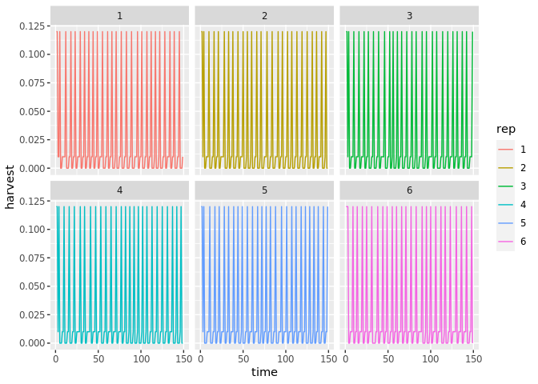
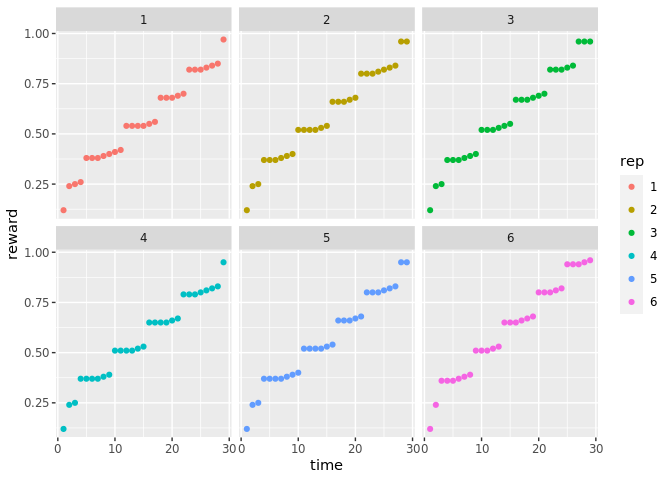

``` r
library(reticulate)
library(tidyverse)
library(fs)
```

``` r
reticulate::py_discover_config()
```

    ## python:         /opt/venv/keras-rl/bin/python
    ## libpython:      /usr/lib/python3.6/config-3.6m-x86_64-linux-gnu/libpython3.6.so
    ## pythonhome:     //usr://usr
    ## version:        3.6.9 (default, Nov  7 2019, 10:44:02)  [GCC 8.3.0]
    ## numpy:          /opt/venv/keras-rl/lib/python3.6/site-packages/numpy
    ## numpy_version:  1.18.2
    ## 
    ## NOTE: Python version was forced by RETICULATE_PYTHON_ENV

``` r
# virtualenv choice has been hardwired by setting RETICULATE_PYTHON_ENV in .Renviron
#reticulate::use_virtualenv("/opt/venv/keras-rl")
```

We let python do all the actual work: (We could alternately call the
python functions directly via reticulate or embed the python in a
`python` code chunk in the notebook, which would let us edit the
parameters more easily here.)

`fishing_discrete.py` sets an action space of 100 actions, each
corresponding to the choice of harvest quota (such that `quota = action
/ n_actions * K`):

``` r
fs::file_delete("fishing-100.csv")
reticulate::source_python("fishing_discrete.py")
```

Let’s plot the results (in R)

``` r
fishing <- read_csv("../fishing-100.csv", 
                    col_names = c("time", "state", "harvest", "action"))
```

    ## Parsed with column specification:
    ## cols(
    ##   time = col_double(),
    ##   state = col_double(),
    ##   harvest = col_double(),
    ##   action = col_double()
    ## )

``` r
d <- max(fishing$time)
n <-dim(fishing)[1] / d

fishing$rep <- as.character(vapply(1:n, rep, integer(d), d))

## Reward is calculated as net (cumulative) reward without any discounting (gamma = 1),
## not the (discounted) net present value typically used in optimal control
gamma <- 0.99
price <- 1.0
fishing <- fishing %>% 
  group_by(rep) %>% 
  mutate(reward = cumsum(price * harvest), 
         npv = cumsum(price * harvest * gamma^time))

## this matches the rewards reported by `dqn.test`:
fishing %>% summarize(max(reward))
```

    ## # A tibble: 6 x 2
    ##   rep   `max(reward)`
    ##   <chr>         <dbl>
    ## 1 1              25.0
    ## 2 2              25.1
    ## 3 3              25.3
    ## 4 4              25.2
    ## 5 5              25.2
    ## 6 6              24.8

Some plots, focusing on the early period to make the pattern more
visible:

``` r
fishing %>% 
  filter(time < 100) %>%
  ggplot(aes(time, state, col = rep)) + geom_line() + facet_wrap(~rep)
```

<!-- -->

``` r
fishing %>% 
  filter(time < 150) %>%
  ggplot(aes(time, harvest, col = rep)) + geom_line() + facet_wrap(~rep)
```

<!-- -->

``` r
fishing %>% 
  filter(time < 30) %>%
  ggplot(aes(time, action, col = rep)) + geom_point() + facet_wrap(~rep)
```

<!-- -->

``` r
fishing %>% 
  filter(time < 30) %>%
  ggplot(aes(time, reward, col = rep)) + geom_point() + facet_wrap(~rep)
```

<!-- -->
